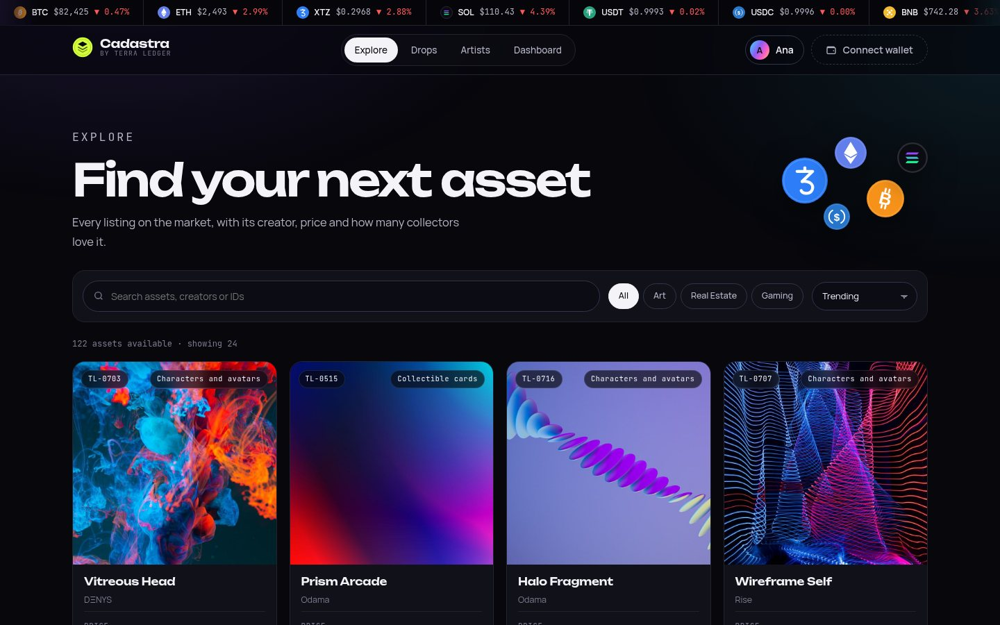
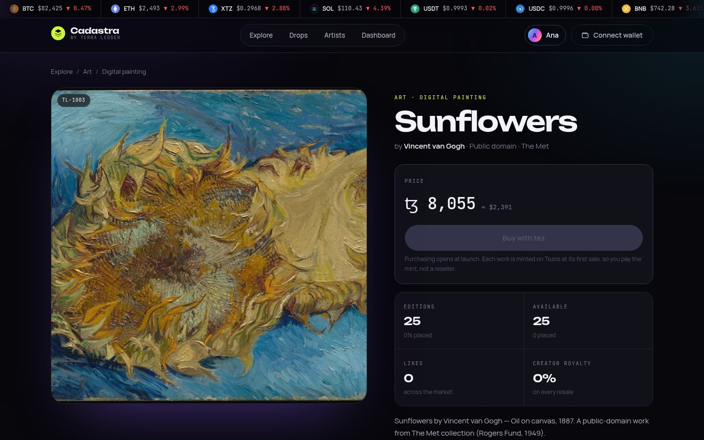

# Cadastra — the NFT marketplace by Terra Ledger


Collect art, property and play on Tezos. **Cadastra** is the NFT marketplace run by
[Terra Ledger](https://www.terraledger.org/), built with Next.js 16 (App Router), React 19 and
TypeScript on PostgreSQL.

**Every price, account, partner and trade on this build is demo data.**

## Introduction

A *cadastre* is the public record of who owns which land — and Terra Ledger tokenizes property
and original artwork. Cadastra is where those tokens, and the works of the creators and brand
partners around them, are listed and collected.

- **122 listed works** in three markets — Art, Real Estate and Gaming — across 11 subcategories:
  the assets published on terraledger.org (properties, Editions artworks, game characters),
  90 public-domain museum works and a 10-piece generative series by Terra Ledger Studio.
- **Open to anyone with a free account.** Email and password; once signed in, every page opens.
  Visitors see the landing page and watermarked previews only.
- **Crypto-native.** Prices in tez (ꜩ) with a live USD reference, a live price strip for 14
  cryptocurrencies on every page, and coin iconography throughout.
- **Drops** released each season with long-term brand partners, and a rolling showcase of the ten
  artists who defined NFTs.
- **Wallet connection and on-chain purchases are not built yet.** The *Connect wallet* button is in
  place and says "coming soon"; that work belongs to the blockchain engineer (decision D11).

| | |
| --- | --- |
|  |  |

## Revenue potential (estimate)

An estimate of what the **current catalogue** could earn in its first year after purchasing goes
live. It is not a forecast: the fees below are assumptions — no fee schedule has been decided —
and nothing can be earned until wallet connection and the sale contract exist.

**What is for sale.** The 111 listed works that are not held back hold **≈ 9.19 million ꜩ** of
unsold primary editions (≈ US$2.73M at 1 ꜩ = US$0.297, 9 October 2026). The 90 museum works
account for about 90% of that, and their prices are placeholders; the website's works carry the
prices published on terraledger.org.

**Assumptions.** Platform fee of **15% on primary sales** (creators keep the rest); **2.5% on
resales**, with first-year resale volume at half of primary volume; creator royalties go to
creators and are not counted.

| Scenario | Primary editions sold in year one | Trading volume (primary + resale) | Platform revenue |
| --- | --- | --- | --- |
| Conservative | 3% | ≈ US$123,000 | **≈ ꜩ 44,800 · US$13,300** |
| Base | 10% | ≈ US$409,000 | **≈ ꜩ 149,300 · US$44,300** |
| Optimistic | 25% | ≈ US$1.02M | **≈ ꜩ 373,400 · US$110,800** |

**Property tokens are the larger opportunity.** Five properties are listed with **39,630 unsold
tokens at US$500 each (≈ US$19.8M)**, but they are held back until counsel approves the structure
(decision Q5 / R-LEGAL). Once cleared, a 2% placement fee would earn about **US$40,000 if 10% of
those tokens are placed, or US$119,000 at 30%** — before any recurring management fee.

**What moves these numbers.** The tez price (every figure is in tez; a 50% move in XTZ moves the
dollar results by the same amount), real prices for the museum works, the size and frequency of
partner drops, and new catalogue. The figures come from the catalogue database; re-run the
queries after any import to refresh them.

## Running the project

### 1. Set up Node.js

```bash
nvm install
```

### 2. Install packages

```bash
npm install
```

### 3. Run locally

```bash
npm run dev
```

## Purpose and mission

**Goal:** be the leading marketplace where people collect and sell NFT assets.

**Mission:** release new NFT creations continuously, season after season, through active and
long-term collaboration with client partners. The landing page, the drop calendar and the partner
programme all point collectors to what is launching next, not only to what is already listed.

## Routes

**The marketplace is members-only.** `src/proxy.ts` sends a visitor without a valid session to
`/login?next=…`, and back to the page they wanted once they have signed in.

| Route | Access | Contents |
| --- | --- | --- |
| `/` | Public | Landing page: hero with listed works, live XTZ/USD rate and market figures, what each members' page is for, live crypto markets, how it works, featured works (watermarked for visitors), markets, drops, five artists, security |
| `/tezos` | Public | What tez is, wallets, costs and risks |
| `/register` | Public | Free sign-up: email, password, display name, terms |
| `/login` | Public | Sign in with email and password |
| `/review/<token>` | Link only | Designer review surface, no sign-in; the token is the credential |
| `/explore` | Members | The whole market: search, sorting, 24 at a time |
| `/explore/[category]` | Members | Art, Real Estate or Gaming, with its subcategories |
| `/explore/[category]/[subcategory]` | Members | One subcategory, e.g. `/explore/gaming/characters` |
| `/nft/[code]` | Members | One work: artwork, price in tez and USD, editions, availability, royalty, licence and source, related works. Unlisted works: sales team only |
| `/drops` | Members | Live drop, release calendar, how drops work, launch partners |
| `/creators` | Members | The ten artists as an automatic slideshow (7 s; pauses on hover or focus; pause button; still under reduced motion). `/creators#slug` opens on that artist |
| `/dashboard` | Members | Role-aware — see below |

Every figure on the site comes from the catalogue or a live price feed; nothing is invented.

## The catalogue: where every work comes from

`seed-data/catalog-sources.json` lists all 118 works; `npm run catalog:fetch` downloads or renders
their images into `private/nft/` and writes `private/nft/catalog.csv`, which
`npm run catalog:import` loads.

| Source | Works | Licence | Notes |
| --- | --- | --- | --- |
| terraledger.org | 18 — 6 properties, 6 Editions artworks, 5 game characters, Elemental RPS Arena key art | Properties and artworks: **Unsplash** photos, as used on the website. Game art: Terra Ledger's own | Titles, prices, supply and descriptions as published. Property tokens are priced at US$500, converted to tez on the day of the fetch |
| The Met Open Access | 90 public-domain works in nine subcategories | **CC0** | Title, maker, date, medium and a link to the museum page on every work. Demo prices; 0% royalty — there is no living artist to pay |
| Terra Ledger Studio | 10 generative works | Terra Ledger's own | Rendered from code (`scripts/lib/generative.mjs`); a seed always draws the same image |

**Before real sales:** the website's six artworks and six property photos are Unsplash stock
images, not the artists' works or the properties themselves. The Unsplash Licence does not allow
selling unaltered photos, so replace them with the originals first (decision D9). Each one says
so on its page.

## Adding works

1. Put the image files in `private/nft/`, at least 1000px wide.
2. Add rows to `private/nft/catalog.csv` (template: `docs/catalog-template.csv`). Leave `code`
   empty and one is assigned (`TL-1001`, …).
3. `npm run catalog:import -- --dry-run` checks every row and file and writes nothing.
4. `npm run catalog:import` writes them, all or nothing. Re-running updates works — matched by
   `code`, or by image file when a row has none — and keeps likes, holders and review links.

| Column | Required | Notes |
| --- | --- | --- |
| `title`, `creator` | Yes | |
| `category` | Yes | `art`, `real-estate` or `gaming` (or the display name) |
| `subcategory` | No | a slug or name from `seed-data/taxonomy.ts`, e.g. `generative` |
| `price_tez` | Yes | in tez; stored exactly, in mutez |
| `file` | Yes | file name inside `private/nft/` |
| `editions`, `placed` | No | supply (default 1) and editions already placed |
| `status` | No | `Live` (default), `Draft`, `In review`, `Revision requested` — only `Live` is shown to members |
| `royalty_pct` | No | 0–25, default 10 |
| `licence` | No | a code from the `licences` table, default `PROPRIETARY` |
| `source_url`, `attribution` | No | where the image comes from, and the credit its licence asks for — shown on the work's page |
| `studio`, `description`, `released`, `code` | No | `released` is `YYYY-MM-DD` |

The import refuses an unknown category, a missing or unreadable file, the same file twice, and two
byte-identical images (each work must be distinct, decision Q7). Once works are imported,
`npm run db:seed` refuses to run, because it would delete them (`-- --force` overrides).

## The ten artists — photos must show the right person

Artists live in the `creators`, `creator_photos` and `featured_works` tables (seeded from
`seed-data/creators.ts`). The order is editorial — `creators.editorial_rank`. The landing page
shows the first five; `/creators` shows all ten as a slideshow with small photos.

Photos go in through a checked import:

1. Put them in `private/creators/`.
2. Describe each in `private/creators/credits.json` (format: `docs/creator-credits.example.json`):
   `subject` (who it shows), `licence`, credit, `sourceUrl`, and `confirmedBy` — who checked that
   the photo shows that artist.
3. `npm run creators:photos -- --dry-run`, then `npm run creators:photos`.

The import refuses a photo without a licence or the credit its licence requires
(`PROPRIETARY` needs a `permission` note), an entry with no `confirmedBy`, and the same image on two
artists. It warns when `subject` does not mention the artist's name, so a swapped file is noticed.
**Pak and XCOPY are anonymous**: they cannot have a portrait — any photo would show someone else —
only an `"kind": "avatar"`, artwork they use instead of a face, captioned as such.

Photos are served by `/api/media/creator/<slug>` exactly as supplied — resized, never cropped,
filtered or watermarked — with their credit line. A reseed keeps them. The site says Terra Ledger
is not affiliated with these artists; keep that notice unless there are partnership agreements.

## Accounts: email and password

Anyone can create an account — no wallet, no balance check.

| Step | What happens |
| --- | --- |
| Register | `POST /api/auth/register` — email, password (8+ characters), optional display name, and the terms (stored with `TERMS_VERSION`). 5 per 10 minutes per client. Signed in at once. |
| Sign in | `POST /api/auth/login` — one message for every failure, and the same work whether or not the email exists. 10 attempts per 15 minutes per client and per email. |
| Sign out | `DELETE /api/auth/session` |

Passwords are stored as salted scrypt hashes (`src/lib/password.ts`). The session cookie is
HttpOnly and signed, and carries the account id; `getViewer()` (`src/lib/viewer.ts`) reads the role
from the database on every request. To sign someone out everywhere:
`UPDATE users SET sessions_valid_after = now() WHERE email = '…'`. Each account's **Cadastra Pass**
is artwork drawn from its email address.

### Wallet connection is switched off

Wallet sign-in, WalletConnect and the $50 balance rule were removed, with their libraries. The
**Connect wallet** button stays right-most in the header (decision Q3): it opens a "coming soon"
note and loads nothing. Rebuilding it, with on-chain purchases and lazy minting at first sale
(decision Q6), is the blockchain engineer's task. Kept for that work: `users.wallet_address`, the
`balance_*` columns and the `auth_nonces` table, unused for now.

## Categories

| Category | Subcategories |
| --- | --- |
| Art | Digital painting · Generative · Photography · 3D and motion |
| Real Estate | Architecture and concept design · Virtual property and interiors · Property certificates* |
| Gaming | In-game items · Characters and avatars · Collectible cards · Game worlds and land |

\* Property certificates are `restricted`: listed, but held back from sale until counsel confirms
the structure (decision Q5 / R-LEGAL). The taxonomy lives in `seed-data/taxonomy.ts`. Category and
subcategory are routes, so a filtered view can be linked and shared.

## Artwork is not public

Image files live in `private/`, outside `public/`, so they have no URL of their own. Every image is
requested through `/api/media/<assetId>`, which decides what the viewer may see:

| Viewer | Gets |
| --- | --- |
| Not signed in | Listed works and drops only: 480px, watermarked **Terra Ledger**, low quality |
| Member | Listed works and drops: clean image, up to 1000px |
| Sales team | Also works that are not listed yet |
| Designer with a review link | Clean image for that one asset (`?rt=<reviewToken>`) |
| Anything else | 404 |

The watermark is the company name (`COMPANY_NAME` in `src/lib/site.ts`, decision D6). Rendered
images are cached in `.data/media-cache` and re-rendered only when the master file changes.
Responses are `Cache-Control: private` with `Vary: Cookie`, and `X-Robots-Tag: noindex,
noimageindex`. A signed-in person can still screenshot their screen, which is why the browser
never receives the full-resolution master.

## The dashboard is role-aware

| Panel | Sales | Client |
| --- | --- | --- |
| KPI row | Yes | No |
| 🔴 Highest sale today | Yes | Yes |
| 🟢 Fairly priced, most liked | Yes | Yes |
| 🟡 Highest-volume buyers | Yes | **No** — the client's own holdings instead |
| Designer suggestions inbox and review links | Yes | No |
| Ranking by category | Yes | Yes |

The server decides the role, and sales-only data is never sent to a client's browser.

## The designer review loop

1. Sales copies an asset's link from **Awaiting the designer** on the dashboard.
2. The designer opens `/review/<token>` — no account needed. Tokens are 128-bit random values.
3. They see the artwork, the brief and how the asset performs, and submit a suggestion.
4. It lands in the sales **Designer suggestions** inbox; only the sales team can change its status.

## Design system

- **Ground:** deep ink (`--bg`) with soft violet and cyan light; **action colour:** lime (`--lime`).
- **Coins and tokens:** the iridescent gradient (`--iri`) and tone palettes in
  `src/components/visuals/Coin.tsx`.
- **Cryptocurrencies:** 14 coin icons in `src/components/visuals/CryptoIcon.tsx` (drawn marks, not
  official logo files), the price strip on every page and the markets grid on the landing page —
  prices from CoinGecko via `src/lib/crypto-prices.ts`, cached five minutes, never invented.
- **Data colours:** red, green and yellow (`--sig-*`) are reserved for dashboard charts.
- **Type:** Unbounded (display), Manrope (body), JetBrains Mono (numbers and labels).
- **Motion:** float, coin spin, tickers and the slideshow all stop under `prefers-reduced-motion`.

All visuals are SVG and CSS. Styles: `src/app/globals.css` (tokens, shared components, app
screens) and `src/app/site.css` (landing, explore, drops, artists).

## Data and money

| Layer | File | Purpose |
| --- | --- | --- |
| Schema | `src/db/sql/*.sql`, `src/db/schema.ts` | The SQL files run (`db:setup`); the TypeScript mirrors them |
| Connection | `src/db/client.ts` | PostgreSQL with `DATABASE_URL`, PGlite without. Server only |
| Queries | `src/lib/repo.ts` | The only place that reads the database |
| Writes | `src/lib/actions.ts`, `src/app/api/auth/*` | Designer suggestions; accounts |
| Fixtures | `seed-data/*` | Seeder and catalogue input — not application code |

Prices are in **tez (ꜩ)**, stored as whole **mutez** (1 ꜩ = 1,000,000 mutez) so no rounding error
can reach a price. `src/lib/price.ts` fetches the XTZ/USD reference rate with a five-minute cache
and a fallback the UI labels as delayed. USD is never the price of record.

## Still to build

- Wallet connection, the sale contract and lazy minting at first sale (blockchain engineer)
- Staff login with two-factor authentication (decision Q4)
- Originals in place of the website's Unsplash images (D9); larger Beeple and Larva Labs photos (D10)
- A platform fee schedule — the revenue estimate above assumes one
- Legal sign-off before property tokens can be sold (R-LEGAL)

Decisions and their status: [`docs/decisions.md`](docs/decisions.md).
