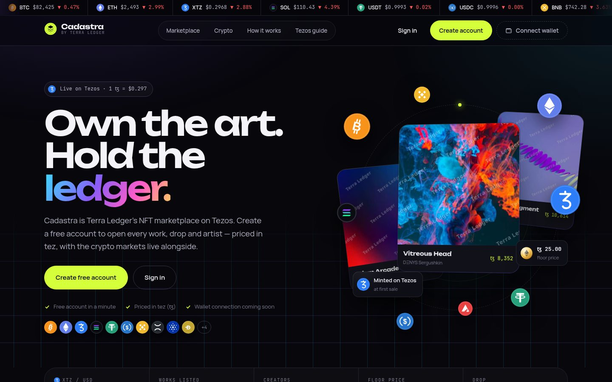

# Cadastra



Cadastra is Terra Ledger's NFT marketplace on Tezos. Every price, account and trade in this build is
demo data.

## Purpose

[Terra Ledger](https://www.terraledger.org/) puts ownership records on-chain so that they settle as
fast as a message. It runs three programmes, each producing tokenized assets on Tezos:

- **Properties** — US buildings, each held in its own SPV and issued as an FA2 token.
- **Editions** — original artworks, digital and physical, minted with full TZIP-21 provenance and a
  contract-enforced 10% royalty.
- **Games** — Mote Mayhem, Twenty-One Showdown and Elemental RPS Arena, whose players earn
  collectibles.

Cadastra is the one place where all of these assets are listed, bought and traded, alongside drops
released each season with Terra Ledger's long-term brand partners. It turns each programme's output
into a liquid market, gives collectors a single account across property, art and play, and lets the
company earn from primary sales and trading.

## Running the project

### 1. Set up Node.js

```bash
nvm install
```

### 2. Install packages

```bash
npm install
```

### 3. Run locally

```bash
npm run dev
```

## Where the project stands

| Area | In place today |
| --- | --- |
| Marketplace | Landing page, explore with categories and search, work pages, drops calendar, artist showcase, role-aware dashboard |
| Accounts | Free email-and-password accounts; members-only pages; signed, revocable sessions; rate-limited sign-in |
| Catalogue | 122 listed works across Art, Real Estate and Gaming, with source and licence recorded for each |
| Media | Private originals served through one route: watermarked previews for visitors, clean images for members |
| Crypto | Prices in tez with a live USD reference; live prices for 14 cryptocurrencies |
| Not yet built | Wallet connection, on-chain purchases, fees and payouts — everything that moves an asset |

## Roadmap

The roadmap runs in five phases, ordered by dependency. Each phase lists its workstreams, what they
deliver, and how the team will know the work is done. Workstreams within a phase run in parallel,
and Phase 1 can start alongside Phase 2.

### Phase 1 — Production foundation

*Goal: a platform that can safely hold real users and real money before any asset moves.*

| Workstream | Deliverables | Done when |
| --- | --- | --- |
| Infrastructure | Managed PostgreSQL, hosting with staging and production environments, secrets management, automated backups | A release reaches staging and production from one pipeline, and a backup restores cleanly |
| Media storage | Move originals from the local `private/` folder to object storage; serve previews through a CDN with signed URLs | No artwork lives on an application server, and previews load from the CDN |
| Delivery pipeline | Continuous integration running lint, type checks, tests and build on every pull request; preview deployments | No change reaches `main` without a green pipeline |
| Account completeness | Email verification, password reset, account deletion and data export | A user can recover an account and remove their data without contacting support |
| Shared state | Rate limits and sessions backed by a shared store (Redis) so the app can run on several instances | Limits hold across instances under load testing |
| Observability | Structured logs, error tracking, uptime and performance monitoring, alerting | An error in production pages the on-call engineer within minutes |
| Staff access | Staff sign-in with two-factor authentication and audit logging for the sales team | Sales roles are granted in an admin screen, not in SQL |

### Phase 2 — On-chain trading

*Goal: collectors can connect a wallet and buy, sell and hold assets on Tezos.*

| Workstream | Deliverables | Done when |
| --- | --- | --- |
| Wallet connection | Beacon / octez.connect for Tezos wallets and WalletConnect v2; link a wallet to an existing account by signing a message | A member links Temple, Kukai or Umami in one step, and the link survives sign-out |
| Token contracts | FA2 contracts (TZIP-12) per collection with TZIP-21 metadata and on-chain royalties | Contracts deploy to Ghostnet from scripts, with royalties readable by other Tezos marketplaces |
| Lazy minting | A mint-on-purchase entrypoint that checks a sale voucher signed by the platform key, so each work is minted at its first sale | A Ghostnet purchase mints the token to the buyer and pays creator, royalty and platform in one operation |
| Marketplace contract | Fixed-price listings, offers and timed auctions held in escrow | Escrow contracts are formally specified and independently audited before mainnet |
| Metadata and files | Pin metadata and media to IPFS; keep the full-resolution file available to the holder only | Every minted token resolves its metadata from IPFS |
| Indexer | Follow chain events through TzKT (or a self-hosted indexer) into the database: mints, sales, transfers, offers | Ownership and sale history on the site match the chain within one block |
| Purchase experience | Buy, offer and bid flows with clear fees, wallet confirmation and transaction status from pending to confirmed | A first-time buyer completes a purchase without leaving the page |
| Portfolio | Holdings, open offers and sale history per member, read from the indexer | The dashboard's holdings come from the chain, not demo data |

### Phase 3 — Marketplace launch

*Goal: a catalogue and experience ready for public launch.*

| Workstream | Deliverables | Done when |
| --- | --- | --- |
| Launch catalogue | Original artworks and property photographs in place of placeholders; final prices; high-resolution artist photos | Every listed work shows its real image and an approved price |
| Creator onboarding | Creator profiles, verification badges, and an upload-and-list flow that records licence and provenance | A verified creator lists a work without staff help, and unverifiable provenance is blocked from minting |
| Catalogue console | An admin console for works, drops, partners and artists, replacing the CSV import | The content team publishes a drop without an engineer |
| Collections and discovery | Collection pages with floor price, volume and owners; traits and rarity for game items; full-text search with filters | A collector finds any work by name, creator, trait or price range |
| Drops engine | Scheduled releases with allowlists, per-wallet limits, supply caps and live mint progress | A partner drop opens and closes on schedule with supply enforced on-chain |
| Engagement | Favourites, watchlists, an activity feed, and in-app and email notifications for outbids, sales and drop openings | A member is told when they are outbid or a followed drop opens |
| Real analytics | Dashboard charts and market figures computed from indexed sales instead of demo data | Every figure on the site traces back to on-chain events |
| Quality | Accessibility review to WCAG 2.2 AA, performance budgets, cross-browser and mobile testing | Core pages pass the accessibility review and load quickly on mobile networks |

### Phase 4 — Property tokens

*Goal: sell fractional property interests once legal review approves the structure.*

| Workstream | Deliverables | Done when |
| --- | --- | --- |
| Investor verification | KYC and accreditation checks through a regulated provider, stored per account with expiry | Only verified investors can reach a property purchase |
| Compliant transfers | An FA2 transfer policy that checks an on-chain registry of verified holders before every transfer, including on secondary sales | A transfer to an unverified wallet is rejected by the contract itself |
| Distributions | Rental income paid to token holders on schedule, with statements per holder | Holders receive distributions and can download annual statements |
| Investor reporting | A property page with documents, occupancy, valuation history and holder notices | Each property shows current documents and performance |

### Phase 5 — Games and growth

*Goal: grow the market beyond Terra Ledger's own catalogue.*

| Workstream | Deliverables | Done when |
| --- | --- | --- |
| Game collectibles | Items earned in Mote Mayhem, Twenty-One Showdown and Elemental RPS Arena minted to players' wallets and tradeable on Cadastra; a plan for collectibles that today live on other chains | A collectible won in a game appears in the player's portfolio and can be listed |
| Cadastra Pass utility | Benefits for members and holders: early access to drops, reduced fees, partner perks | Pass benefits apply automatically at checkout and in drop allowlists |
| Partner programme | A partner console for drop briefs, creator matching and post-drop reporting | A partner plans and reviews a season of drops in one place |
| Payments | Card checkout through a regulated on-ramp partner for collectors without crypto | A collector without a wallet completes a purchase by card |
| International launch | Localization for the first launch markets, local currency references, regional legal terms | The site launches in its first non-English market |
| Mobile | An installable app experience (PWA) with wallet deep links | A member buys from a phone with a mobile wallet |
| Partner API | A read API for listings, prices and sales, for partners and aggregators | Partners embed live Cadastra listings on their own sites |
| Trust and safety | Takedown process for infringing works, suspicious-trading detection, and stolen-asset flagging | Reported works are reviewed and resolved within a set time |

### Engineering principles

- **Ghostnet before mainnet.** Every contract and flow runs on the Tezos test network first.
- **Audited escrow.** Contracts that hold funds are formally specified, tested and independently
  audited before they hold real value.
- **The chain is the record.** Ownership, sales and royalties on the site always come from indexed
  on-chain data.
- **Provenance first.** A work whose provenance cannot be substantiated is not minted.
- **Exact money.** Amounts stay in mutez end to end; USD is only ever a reference.
